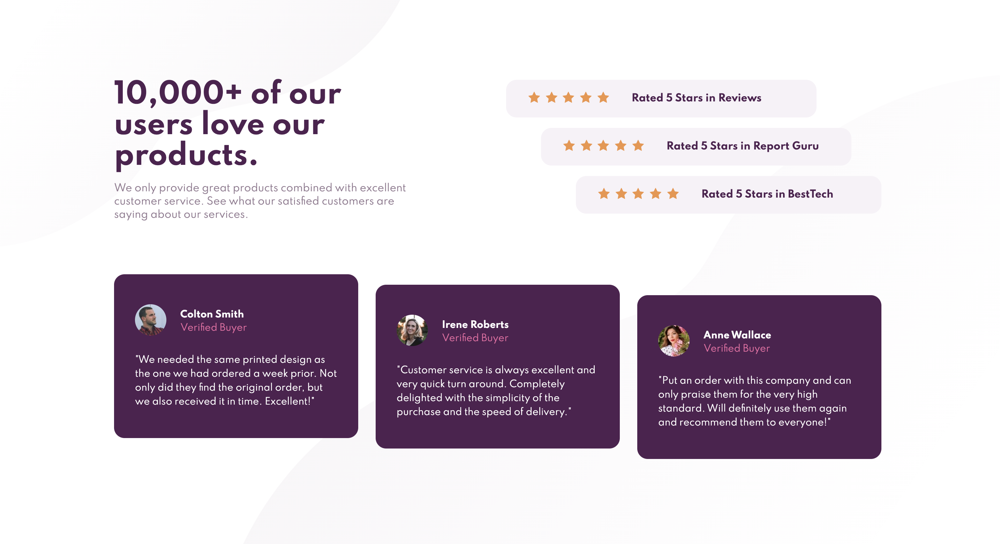

# Frontend Mentor - Social proof section solution

This is my solution to the [Social proof section challenge on Frontend Mentor](https://www.frontendmentor.io/challenges/social-proof-section-6e0qTv_bA). Any feedback is appreciated :relaxed:!

### Screenshot

   
   

### Links

- Solution URL: [https://www.frontendmentor.io/solutions/social-proof-section-5tOrYQrR3](https://www.frontendmentor.io/solutions/social-proof-section-5tOrYQrR3)
- Live Site URL: [https://ellieroy.github.io/social-proof-section/](https://ellieroy.github.io/social-proof-section/)

### Built with

- Semantic HTML5 markup
- CSS custom properties
- Flexbox
- CSS Grid

## Author

- Frontend Mentor - [@ellieroy](https://www.frontendmentor.io/profile/ellieroy)